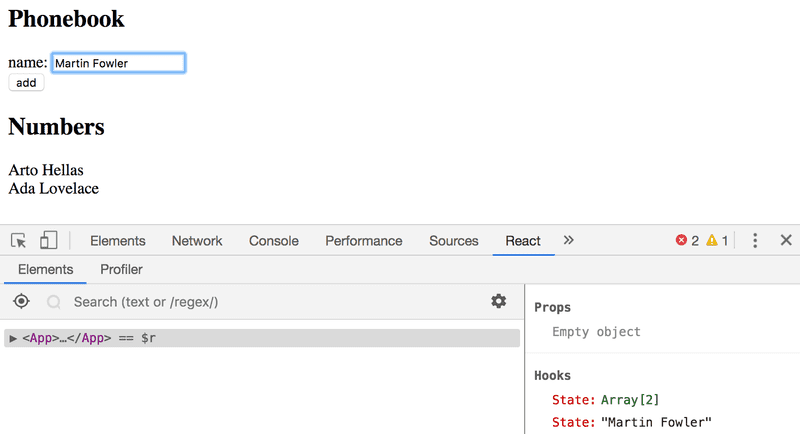
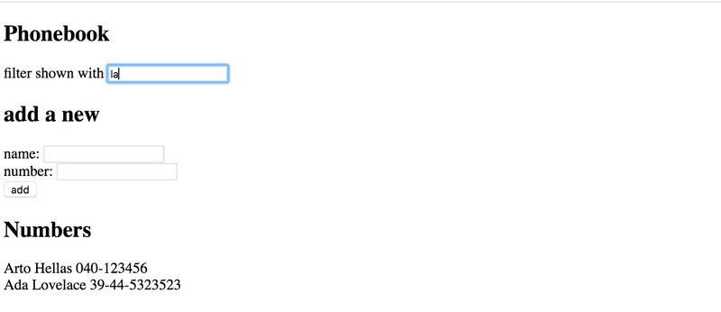

# Exercises 2.6.-2.10

In the first exercise, we will start working on an application that will be further developed in the later exercises. In related sets of exercises, it is sufficient to return the final version of your application. You may also make a separate commit after you have finished each part of the exercise set, but doing so is not required.

## 2.6: The Phonebook Step 1

Let's create a simple phonebook. **_In this part, we will only be adding names to the phonebook._**

Let us start by implementing the addition of a person to the phonebook.

You can use the code below as a starting point for the _App_ component of your application:

```jsx
import { useState } from 'react';

const App = () => {
  const [persons, setPersons] = useState([{ name: 'Arto Hellas' }]);
  const [newName, setNewName] = useState('');

  return (
    <div>
      <h2>Phonebook</h2>
      <form>
        <div>
          name: <input />
        </div>
        <div>
          <button type="submit">add</button>
        </div>
      </form>
      <h2>Numbers</h2>
      ...
    </div>
  );
};

export default App;
```

The `newName` state is meant for controlling the form input element.

Sometimes it can be useful to render state and other variables as text for debugging purposes. You can temporarily add the following element to the rendered component:

```jsx
<div>debug: {newName}</div>
```

It's also important to put what we learned in the [debugging React applications](https://fullstackopen.com/en/part1/a_more_complex_state_debugging_react_apps) chapter of part one into good use. The [React developer tools](https://chromewebstore.google.com/detail/react-developer-tools/fmkadmapgofadopljbjfkapdkoienihi) extension is _incredibly_ useful for tracking changes that occur in the application's state.

After finishing this exercise your application should look something like this:



Note the use of the React developer tools extension in the picture above!

**NB:**

- you can use the person's name as a value of the key property
- remember to prevent the default action of submitting HTML forms!

## 2.7: The Phonebook Step 2

Prevent the user from being able to add names that already exist in the phonebook. JavaScript arrays have numerous suitable [methods](https://developer.mozilla.org/en-US/docs/Web/JavaScript/Reference/Global_Objects/Array) for accomplishing this task. Keep in mind [how object equality works](https://www.joshbritz.co/blog/why-its-so-hard-to-check-object-equality) in Javascript.

Issue a warning with the [alert](https://developer.mozilla.org/en-US/docs/Web/API/Window/alert) command when such an action is attempted:


Hint: when you are forming strings that contain values from variables, it is recommended to use a [template string](https://developer.mozilla.org/en-US/docs/Web/JavaScript/Reference/Template_literals):

```jsx
`${newName} is already added to phonebook`;
```

If the `newName` variable holds the value _Arto Hellas_, the template string expression returns the string

```jsx
`Arto Hellas is already added to phonebook`;
```

The same could be done in a more Java-like fashion by using the plus operator:

```jsx
newName + ' is already added to phonebook';
```

Using template strings is the more idiomatic option and the sign of a true JavaScript professional.

## 2.8: The Phonebook Step 3

Expand your application by allowing users to add phone numbers to the phone book. You will need to add a second _input_ element to the form (along with its own event handler):

```jsx
<form>
  <div>
    name: <input />
  </div>
  <div>
    number: <input />
  </div>
  <div>
    <button type="submit">add</button>
  </div>
</form>
```

At this point, the application could look something like this. The image also displays the application's state with the help of [React developer tools](https://chromewebstore.google.com/detail/react-developer-tools/fmkadmapgofadopljbjfkapdkoienihi):


## 2.9\*: The Phonebook Step 4

Implement a search field that can be used to filter the list of people by name:



You can implement the search field as an _input_ element that is placed outside the HTML form. The filtering logic shown in the image is _case insensitive_, meaning that the search term _arto_ also returns results that contain Arto with an uppercase A.

**NB:** When you are working on new functionality, it's often useful to "hardcode" some dummy data into your application, e.g.

```jsx
const App = () => {
  const [persons, setPersons] = useState([
    { name: 'Arto Hellas', number: '040-123456', id: 1 },
    { name: 'Ada Lovelace', number: '39-44-5323523', id: 2 },
    { name: 'Dan Abramov', number: '12-43-234345', id: 3 },
    { name: 'Mary Poppendieck', number: '39-23-6423122', id: 4 },
  ]);

  // ...
};
```

This saves you from having to manually input data into your application for testing out your new functionality.
